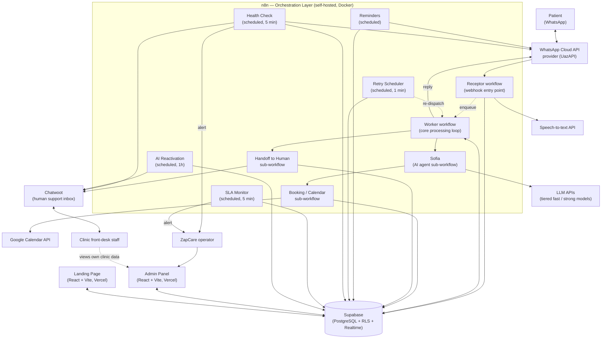
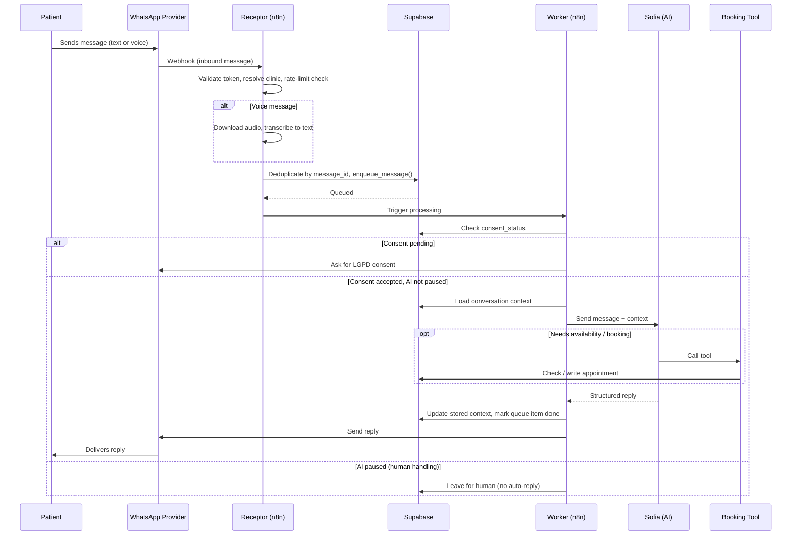
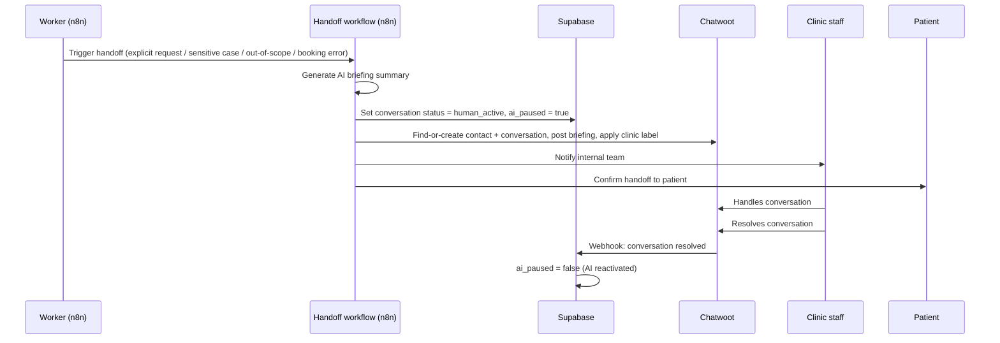

# Architecture

> 🇧🇷 [Ler em português](../pt-BR/arquitetura.md)

## 1. Overview

ZapCare is composed of six cooperating systems rather than a single application:

1. A **workflow orchestration layer** (n8n) that owns message ingestion, queueing, routing, reminders, and self-monitoring.
2. A **conversational AI agent** ("Sofia") called by the orchestration layer, backed by tiered LLM models with tool-calling.
3. A **relational data layer** (Supabase/PostgreSQL) that is the single source of truth for clinics, conversations, the message queue, appointments, consent, and logs.
4. A **human handoff surface** (Chatwoot) that receives escalated conversations with AI-generated context.
5. Two **web applications** (admin panel and landing page) — React/TypeScript/Vite, talking directly to Supabase.
6. External integrations: WhatsApp (via a third-party Cloud API provider, UazAPI), Google Calendar, and a speech-to-text API for voice messages.

The guiding architectural principle is **the database is the contract**. n8n workflows, the admin panel, and the landing page never talk to each other directly — they all read and write through Supabase, using Row-Level Security plus narrow `SECURITY DEFINER` RPCs to keep write paths controlled. This lets the automation layer (n8n) and the software layer (React apps) evolve independently.

## 2. High-level diagram

## 3. Core components

### 3.1 Sofia — the AI agent

Sofia is an n8n sub-workflow, not a standalone service. It:

- Loads and formats the conversation's stored context (history + a running "memory" summary, capped and refreshed to control token cost).
- Classifies query complexity and routes between a **fast/cheap model tier** and a **stronger model tier** — a deliberate cost-control decision (see [ADR-0005](adrs/0005-ai-first-contact.md)).
- Holds two callable **tools**: check calendar availability and book an appointment, each implemented as its own small n8n sub-workflow rather than inline logic — so the tool contract (input/output shape) is stable regardless of which model is answering.
- Uses windowed conversation memory (bounded, not the full unbounded history) to keep prompts small and predictable in cost.
- Returns a structured response that the Worker parses to decide the next action (reply directly, trigger booking, or hand off).

Sofia is deliberately **not** allowed to: give a clinical diagnosis, promise a procedure outcome, quote a price that isn't configured for that clinic, or continue a conversation once a human has taken over. See [Business Rules](business-rules.md) and [Sofia AI Flows](sofia-ai-flows.md).

### 3.2 Orchestration layer (n8n)

n8n is the system's control plane. Production workflows, by role:

| Workflow | Role |
|---|---|
| Receptor | Webhook entry point for inbound WhatsApp messages. Validates the webhook token, resolves the clinic, applies per-clinic rate limiting, deduplicates by message ID, branches audio (→ transcription) vs. text, detects reminder replies, and enqueues the message. |
| Worker | The core loop. Pulls from the queue, enforces the LGPD consent gate, checks whether AI is paused for that conversation, calls Sofia, parses the response, routes to booking or handoff, sends the reply, and updates queue status (done / retry / permanently failed). |
| Tool: Check Availability / Tool: Book Appointment | Small, single-purpose sub-workflows called by Sofia as tools. |
| Booking / Calendar | Creates or updates the Google Calendar event, writes the `appointments` row, logs the event, and confirms to the patient — with a fallback path if Calendar is unavailable. |
| Handoff to Human | Generates an AI briefing, pauses the AI for that conversation, finds-or-creates the Chatwoot contact/conversation, posts the briefing, labels it by clinic, and notifies the internal team. |
| Chatwoot Webhook | Listens for conversation-resolved events from Chatwoot and re-enables the AI for that conversation. |
| Reminders | Two scheduled triggers (next-day and same-day windows) that send appointment reminders and track confirmations. |
| Retry Scheduler | Runs every minute; promotes failed/stuck queue items back to retry, re-dispatches them, and moves items past a retry threshold to a dead-letter state with an operator alert. Also runs scheduled LGPD data cleanup. |
| Health Check | Runs every 5 minutes; pings the database, WhatsApp provider, and Chatwoot, checks for queue backlog and abnormal send volume, and alerts the operator — each alert type has its own cooldown to avoid alert fatigue. |
| SLA Monitor | Runs every 5 minutes; finds human handoffs that have exceeded the response SLA and alerts the operator. |
| AI Reactivation | Runs hourly; finds conversations abandoned mid-handoff past a cutoff, and reactivates the AI with a generated follow-up message. |

A staging mirror exists for the highest-risk workflows (Receptor, Worker, Sofia, Reactivation), gated by an allowlist of test phone numbers so staging changes can never reach a real patient — see [ADR-0006](adrs/0006-admin-landing-workflows-separation.md).

### 3.3 Data layer (Supabase / PostgreSQL)

Key tables (all scoped by `clinic_id` for multi-tenancy):

- `clinics` — configuration per clinic: business hours, AI prompt, plan, rate limit, handoff labels, calendar IDs, billing status.
- `conversations` — one row per patient/clinic pair; tracks status (`bot_active` / `human_active` / `closed`), consent status, stored context, SLA status, and the linked Chatwoot conversation.
- `message_queue` — the async processing queue: payload, status (`pending`/`processing`/`done`/`retry`/`failed`/`failed_permanent`), retry count, next retry time, error message.
- `processed_messages` — idempotency guard, unique on `(message_id, clinic_id)`.
- `consent_records` — immutable LGPD consent audit trail (never deleted).
- `appointments` — booking record with status, source, confirmation, and reminder tracking.
- `logs` — structured operational logs (errors, warnings, AI responses, transcriptions) tagged by workflow and node.
- `crm_leads` / `crm_notes` — the sales pipeline (lead → qualified → demo → pilot → customer), consumed by the admin CRM UI and the landing page's lead-capture form. `[to validate: schema not yet migrated into version control — currently managed directly in the live database]`.

Key reliability RPCs: `enqueue_message` (atomically writes the conversation + queue row, tolerant of race conditions), `promote_failed_to_retry` (exponential backoff), `check_rate_limit`, `record_consent`, `get_sla_breached_conversations` / `mark_sla_breached`, `cleanup_old_data` (LGPD retention enforcement). Billing status changes go through a single `SECURITY DEFINER` RPC restricted to the operator's account, rather than direct table writes from the admin panel — see [Business Rules § Billing](business-rules.md#5-billing--trial-rules).

### 3.4 Human handoff (Chatwoot)

Chatwoot is the support inbox clinic staff actually use. Every handoff carries an AI-generated briefing so a human never starts cold. When a Chatwoot agent resolves the conversation, a webhook re-enables Sofia automatically — the handoff is a loop, not a one-way door.

### 3.5 Admin panel

A React/TypeScript/Vite SPA (Tailwind CSS v4, React Router, deployed on Vercel), authenticated via Supabase Auth, reading and writing Supabase directly (no separate backend API). It gives the ZapCare operator: a clinic list with manual billing controls, live conversation/appointment/queue views (polling-based auto-refresh, pauses when the tab is backgrounded), and a full CRM for the sales pipeline. Sensitive write actions (pausing AI, requeueing a message, changing billing status) are logged for auditability rather than firing silently.

### 3.6 Landing page

A public marketing site (same stack as the admin panel) with an interactive lead-qualification flow that writes directly into the CRM lead table under a restrictive insert-only policy — the public site can create leads but can never read them back.

## 4. Data flow: message lifecycle

## 5. Data flow: human handoff

## 6. Reliability mechanisms

- **Idempotency**: every inbound message is deduplicated by `message_id` before entering the queue, so a WhatsApp provider retry never produces a duplicate reply.
- **Retry with backoff**: failed queue items are retried with exponential backoff; after a fixed number of attempts they move to a `failed_permanent` (dead-letter) state and trigger an operator alert instead of retrying forever.
- **Stuck-item recovery**: the Retry Scheduler also detects items stuck in `processing` (e.g. a workflow crash mid-execution) and promotes them back to `retry`.
- **Health checks**: every 5 minutes, the system checks its own dependencies (database, WhatsApp provider, Chatwoot) and its own queue backlog / send-volume anomalies, alerting the operator before a clinic notices.
- **SLA monitoring**: human handoffs that sit unanswered past a threshold are flagged and alert the operator, rather than silently ageing in Chatwoot.
- **Consent as a hard gate**: no AI reply is ever generated before consent is resolved — this is enforced in the Worker, not left to prompt instructions.

## 7. Security boundaries

- **Row-Level Security is enabled on every table.** The anonymous key (used by the public landing page) can only `INSERT` into `crm_leads` — it has no `SELECT` policy, so a public form can create a lead but never enumerate the sales pipeline.
- **n8n uses the Supabase `service_role` key** (RLS bypass) because it is a trusted backend process; this key is never exposed to the admin panel, the landing page, or any exported workflow file.
- **Billing status changes go through one `SECURITY DEFINER` RPC**, hardcoded to only accept calls from the operator's account — the admin panel has no direct `UPDATE` path to `clinics.billing_status`.
- **`$env.*` variables are unavailable in the n8n Docker deployment** `[operational constraint, not a security choice]` — all workflow secrets are stored as n8n credentials rather than environment variables. This is called out explicitly because it shapes how every workflow is built; see [ADR-0007](adrs/0007-logging-and-audit-strategy.md).
- **Sensitive admin actions are logged**, not just executed — pausing AI, requeueing a failed message, and changing billing status all write an audit trail.

## 8. Deployment topology

| Component | Hosting | `[status]` |
|---|---|---|
| n8n | Self-hosted, Docker | Confirmed |
| Chatwoot | Self-hosted | Confirmed |
| Supabase | Managed (Supabase Cloud) | Confirmed |
| Admin panel | Vercel | Confirmed |
| Landing page | Vercel | Confirmed |
| CI/CD | Manual deploys (`vercel --prod`) | Confirmed — automated CI/CD is on the roadmap, not yet implemented |

## 9. Known architecture debt

Documented here deliberately — a case study that hides its rough edges is less credible than one that shows how they're tracked:

- `crm_leads` / `crm_notes` schema currently lives only in the deployed database, not in version-controlled migrations — a gap flagged for follow-up.
- Two separate SQL migration streams exist (a core schema/migrations set, and a newer billing/CRM set) that haven't been consolidated into one chronological history yet.
- Staging and production maintain parallel copies of the highest-risk workflows (Receptor, Worker, Sofia) rather than a single parameterized workflow with an environment switch — simpler to reason about today, but a duplication cost as the workflow count grows.
- No automated CI/CD for the two web apps yet; deploys are manual.
