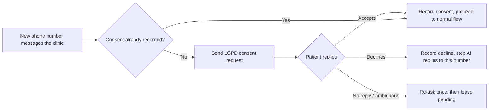
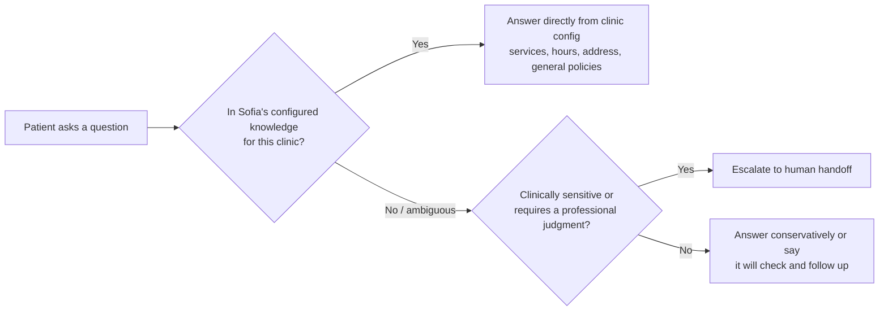
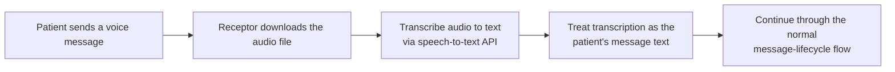
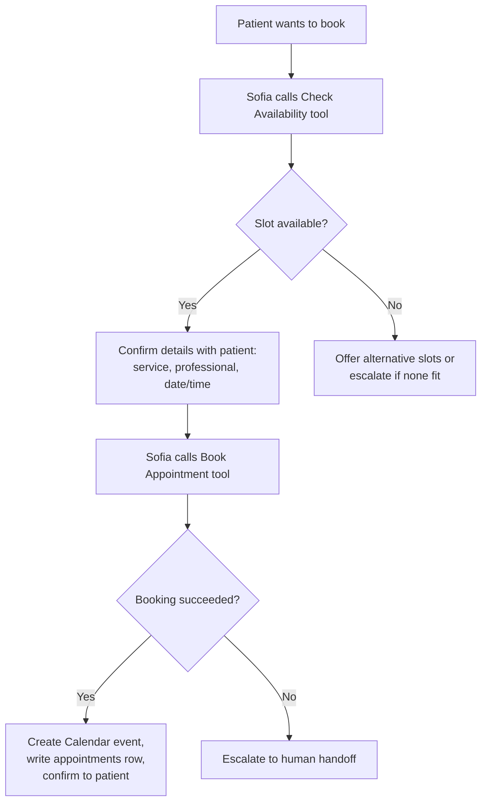
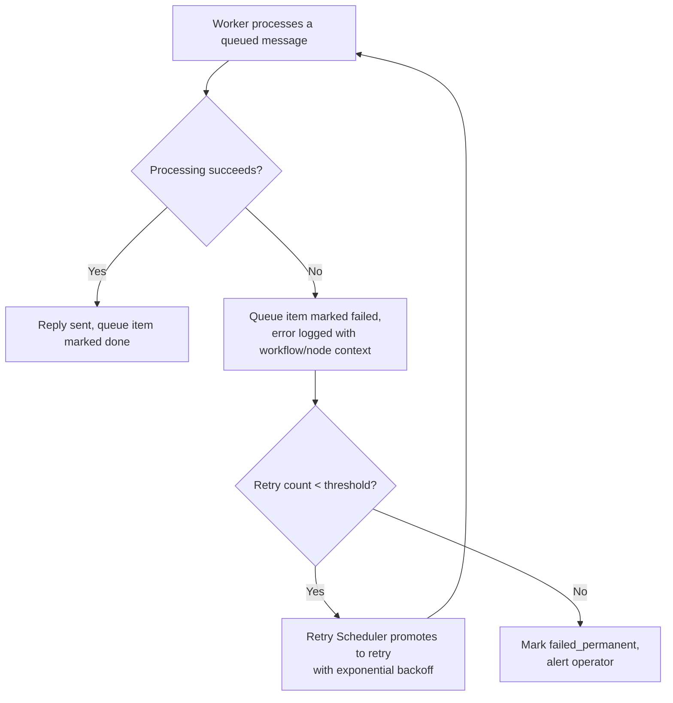
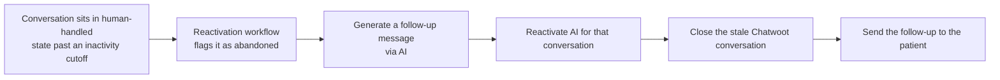

# Sofia AI Flows

> 🇧🇷 [Ler em português](../pt-BR/fluxos-sofia-ia.md)

Sofia is not one prompt — it is a set of distinct conversational flows, each with its own entry conditions and guardrails, orchestrated by the Worker workflow (see [Architecture](architecture.md)). This document describes each flow's logic. Exact prompt text is not reproduced (proprietary and clinic-specific); the flow structure and decision points are.

## 1. First message flow

The first message from any new phone number never reaches Sofia's general-purpose reasoning — it is intercepted by the consent gate first. This is a deliberate ordering: compliance before conversation.

## 2. Qualification flow

Once consent is recorded, Sofia's first real reply establishes basic context: what the patient is looking for (service/specialty) and whether they're a new or returning patient at the clinic. This isn't a rigid form — it's folded into natural conversation — but the underlying goal is structured: identify intent early enough to route correctly (FAQ vs. booking vs. "this needs a human") rather than free-wheeling indefinitely.

## 3. FAQ / frequently-asked-questions flow

Sofia answers from clinic-specific configured knowledge (services offered, hours, general policies) — it does not answer clinical questions from general model knowledge, by rule (see [Business Rules § 2](business-rules.md#2-conversation--service-rules)).

## 4. Voice message (audio) flow

Voice is normalized to text before anything else happens — Sofia and every downstream rule (consent gate, intent routing, logging) operate on text only, so audio support required no special-casing of the conversational logic itself.

## 5. Scheduling / booking flow

Booking is tool-mediated, not prompt-mediated: Sofia cannot simply assert an appointment exists in its reply text. It must call the availability tool and the booking tool, which write to the real calendar and database — this is what makes the "AI booked my appointment" claim actually true rather than a plausible-sounding hallucination.

## 6. Objection-handling flow

When a patient hesitates (price concerns, uncertainty about the procedure, comparing to another clinic), Sofia is scoped to: acknowledge the concern, restate value using only clinic-configured information (never fabricated claims or outcomes), and offer the lowest-friction next step (usually scheduling an evaluation, not a hard close). If the objection is about something Sofia has no configured answer for (e.g., a specific discount not in its config), it does not improvise a commitment — it escalates or defers rather than making a promise the clinic didn't authorize.

## 7. Human handoff flow

Covered in full in [Architecture § 5](architecture.md#5-data-flow-human-handoff) and [Business Rules § 3](business-rules.md#3-human-handoff-rules). In summary: explicit request, sensitive content, out-of-scope question, or a failed booking operation all trigger the same handoff path — an AI-generated briefing, an immediate AI pause for that conversation, and a labeled Chatwoot conversation for the clinic's staff.

## 8. Error / fallback flow

There is no silent failure path: every failure is logged with enough context (which workflow, which node, the error message) to debug it, and every message either eventually succeeds, reaches a human, or becomes a flagged dead-letter item the operator sees — never a message that just vanishes.

## 9. Follow-up / reactivation flow

This flow exists specifically to prevent a failure mode where a patient is transferred to a human, no one answers in time, and the conversation simply dies. It runs on a schedule (hourly) rather than being triggered by any single event, since "abandonment" is a time-based condition, not a discrete one.
