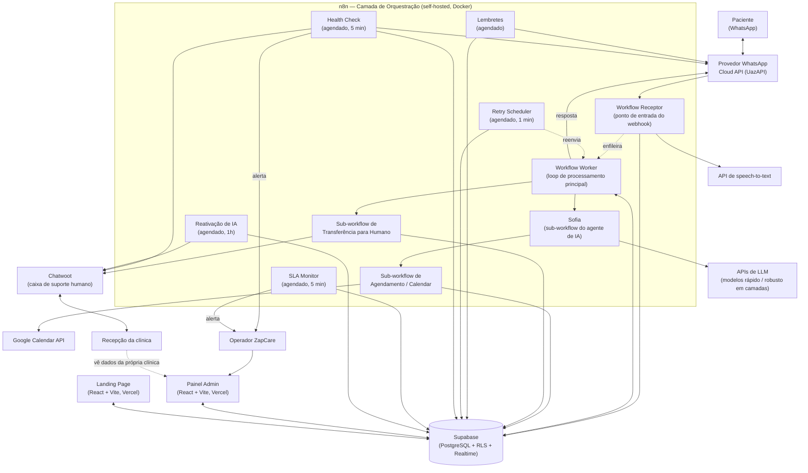
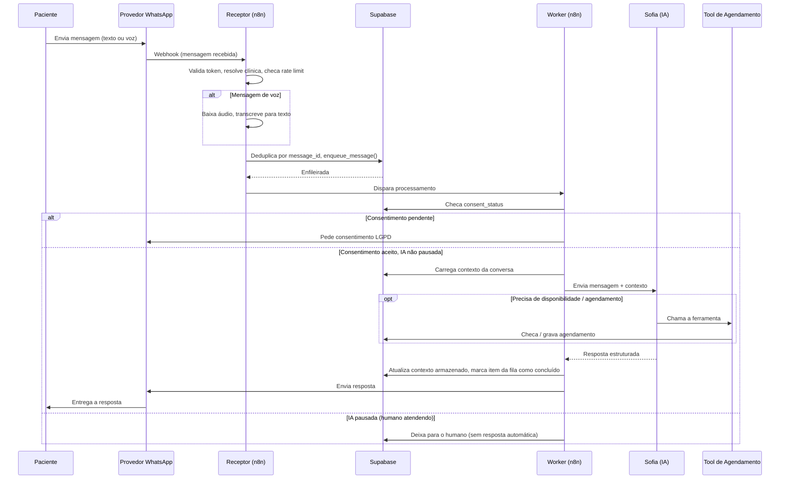
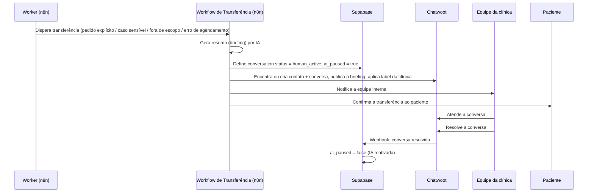

# Arquitetura

> 🇺🇸 [Read in English](../en/architecture.md)

## 1. Visão geral

O ZapCare é composto por seis sistemas que cooperam entre si, não uma aplicação única:

1. Uma **camada de orquestração de workflows** (n8n), responsável por ingestão de mensagens, fila, roteamento, lembretes e automonitoramento.
2. Um **agente de IA conversacional** ("Sofia"), chamado pela camada de orquestração, com modelos de LLM em camadas e chamada de ferramentas.
3. Uma **camada de dados relacional** (Supabase/PostgreSQL), fonte única de verdade para clínicas, conversas, fila de mensagens, agendamentos, consentimento e logs.
4. Uma **superfície de transferência humana** (Chatwoot), que recebe conversas escaladas com contexto gerado por IA.
5. Duas **aplicações web** (painel admin e landing page) — React/TypeScript/Vite, falando diretamente com o Supabase.
6. Integrações externas: WhatsApp (via provedor terceiro de Cloud API, UazAPI), Google Calendar e uma API de speech-to-text para mensagens de voz.

O princípio arquitetural central é **o banco de dados é o contrato**. Os workflows do n8n, o painel admin e a landing page nunca falam diretamente entre si — todos leem e escrevem através do Supabase, usando Row-Level Security e RPCs `SECURITY DEFINER` estreitas para manter os caminhos de escrita controlados. Isso permite que a camada de automação (n8n) e a camada de software (apps React) evoluam de forma independente.

## 2. Diagrama de alto nível

## 3. Componentes principais

### 3.1 Sofia — o agente de IA

A Sofia é um sub-workflow do n8n, não um serviço à parte. Ela:

- Carrega e formata o contexto armazenado da conversa (histórico + um resumo de "memória" contínuo, limitado e renovado para controlar custo de tokens).
- Classifica a complexidade da pergunta e roteia entre um **modelo rápido/barato** e um **modelo mais robusto** — uma decisão deliberada de controle de custo (ver [ADR-0005](adrs/0005-ia-no-primeiro-contato.md)).
- Possui duas **ferramentas** chamáveis: checar disponibilidade na agenda e agendar uma consulta, cada uma implementada como um sub-workflow próprio do n8n em vez de lógica embutida no prompt — assim o contrato da ferramenta (formato de entrada/saída) fica estável independente de qual modelo está respondendo.
- Usa memória de conversa em janela (limitada, não o histórico completo ilimitado) para manter os prompts pequenos e o custo previsível.
- Retorna uma resposta estruturada que o Worker interpreta para decidir a próxima ação (responder diretamente, disparar agendamento ou transferir).

A Sofia é deliberadamente **proibida** de: dar diagnóstico clínico, prometer resultado de procedimento, cotar preço não configurado para aquela clínica, ou continuar uma conversa depois que um humano assumiu. Ver [Regras de Negócio](regras-de-negocio.md) e [Fluxos da Sofia IA](fluxos-sofia-ia.md).

### 3.2 Camada de orquestração (n8n)

O n8n é o plano de controle do sistema. Workflows de produção, por função:

| Workflow | Função |
|---|---|
| Receptor | Ponto de entrada do webhook para mensagens recebidas no WhatsApp. Valida o token do webhook, resolve a clínica, aplica rate limit por clínica, deduplica por ID de mensagem, ramifica áudio (→ transcrição) vs. texto, detecta respostas de lembrete e enfileira a mensagem. |
| Worker | O loop principal. Retira da fila, garante o gate de consentimento LGPD, checa se a IA está pausada naquela conversa, chama a Sofia, interpreta a resposta, roteia para agendamento ou transferência, envia a resposta e atualiza o status da fila (concluído / retry / falha permanente). |
| Tool: Checar Disponibilidade / Tool: Agendar Consulta | Sub-workflows pequenos e de propósito único, chamados pela Sofia como ferramentas. |
| Agendamento / Calendar | Cria ou atualiza o evento no Google Calendar, grava a linha em `appointments`, registra o evento e confirma ao paciente — com um caminho alternativo caso o Calendar esteja indisponível. |
| Transferência para Humano | Gera um briefing por IA, pausa a IA naquela conversa, encontra ou cria o contato/conversa no Chatwoot, publica o briefing, aplica a label da clínica e notifica a equipe interna. |
| Chatwoot Webhook | Escuta eventos de conversa resolvida vindos do Chatwoot e reativa a IA naquela conversa. |
| Lembretes | Dois gatilhos agendados (janela do dia seguinte e do mesmo dia) que enviam lembretes de consulta e rastreiam confirmações. |
| Retry Scheduler | Roda a cada minuto; promove itens falhos ou travados da fila de volta para retry, os reenvia, e move itens que passaram do limite de tentativas para um estado de dead-letter com alerta ao operador. Também roda a limpeza agendada de dados por LGPD. |
| Health Check | Roda a cada 5 minutos; testa banco de dados, provedor de WhatsApp e Chatwoot, checa acúmulo de fila e volume de envio anômalo, e alerta o operador — cada tipo de alerta tem seu próprio cooldown para evitar fadiga de alerta. |
| SLA Monitor | Roda a cada 5 minutos; encontra transferências humanas que estouraram o SLA de resposta e alerta o operador. |
| Reativação de IA | Roda a cada hora; encontra conversas abandonadas no meio de uma transferência além de um limite de tempo, e reativa a IA com uma mensagem de follow-up gerada. |

Existe um espelho de staging para os workflows de maior risco (Receptor, Worker, Sofia, Reativação), protegido por uma allowlist de números de teste, para que mudanças em staging nunca cheguem a um paciente real — ver [ADR-0006](adrs/0006-separacao-admin-landing-workflows.md).

### 3.3 Camada de dados (Supabase / PostgreSQL)

Tabelas principais (todas isoladas por `clinic_id` para multi-tenancy):

- `clinics` — configuração por clínica: horário de funcionamento, prompt da IA, plano, rate limit, labels de transferência, IDs de calendário, status de cobrança.
- `conversations` — uma linha por par paciente/clínica; rastreia status (`bot_active` / `human_active` / `closed`), status de consentimento, contexto armazenado, status de SLA e a conversa vinculada no Chatwoot.
- `message_queue` — a fila assíncrona de processamento: payload, status (`pending`/`processing`/`done`/`retry`/`failed`/`failed_permanent`), contagem de tentativas, próxima tentativa, mensagem de erro.
- `processed_messages` — trava de idempotência, única em `(message_id, clinic_id)`.
- `consent_records` — trilha de auditoria de consentimento LGPD, imutável (nunca apagada).
- `appointments` — registro de agendamento com status, origem, confirmação e rastreamento de lembrete.
- `logs` — logs operacionais estruturados (erros, avisos, respostas da IA, transcrições), etiquetados por workflow e nó.
- `crm_leads` / `crm_notes` — o pipeline comercial (lead → qualificado → demo → piloto → cliente), consumido pela UI de CRM do admin e pelo formulário de captura de lead da landing page. `[a validar: schema ainda não migrado para versionamento — hoje é mantido diretamente no banco em produção]`.

RPCs de confiabilidade principais: `enqueue_message` (grava conversa + linha da fila atomicamente, tolerante a condições de corrida), `promote_failed_to_retry` (backoff exponencial), `check_rate_limit`, `record_consent`, `get_sla_breached_conversations` / `mark_sla_breached`, `cleanup_old_data` (aplicação da retenção LGPD). Mudanças de status de cobrança passam por uma única RPC `SECURITY DEFINER` restrita à conta do operador, em vez de escrita direta na tabela pelo painel admin — ver [Regras de Negócio § Cobrança](regras-de-negocio.md#5-regras-de-cobrança--trial).

### 3.4 Transferência humana (Chatwoot)

O Chatwoot é a caixa de suporte que a equipe da clínica de fato usa. Toda transferência carrega um briefing gerado por IA, então um humano nunca começa do zero. Quando um agente do Chatwoot resolve a conversa, um webhook reativa a Sofia automaticamente — a transferência é um loop, não uma porta de mão única.

### 3.5 Painel administrativo

Uma SPA React/TypeScript/Vite (Tailwind CSS v4, React Router, deploy na Vercel), autenticada via Supabase Auth, lendo e escrevendo diretamente no Supabase (sem uma API backend separada). Ela dá ao operador do ZapCare: uma lista de clínicas com controle manual de cobrança, visões ao vivo de conversas/agendamentos/fila (auto-refresh por polling, que pausa quando a aba fica em segundo plano) e um CRM completo para o pipeline comercial. Ações de escrita sensíveis (pausar IA, reenfileirar mensagem, mudar status de cobrança) são registradas em log para auditoria, em vez de disparar silenciosamente.

### 3.6 Landing page

Um site de marketing público (mesma stack do painel admin) com um fluxo interativo de qualificação de leads que escreve diretamente na tabela de leads do CRM, sob uma política restritiva de apenas-inserção — o site público consegue criar um lead, mas nunca consegue lê-lo de volta.

## 4. Fluxo de dados: ciclo de vida de uma mensagem

## 5. Fluxo de dados: transferência para humano

## 6. Mecanismos de confiabilidade

- **Idempotência**: toda mensagem recebida é deduplicada por `message_id` antes de entrar na fila, então um retry do provedor de WhatsApp nunca gera uma resposta duplicada.
- **Retry com backoff**: itens falhos na fila são reprocessados com backoff exponencial; após um número fixo de tentativas, migram para um estado `failed_permanent` (dead-letter) e disparam um alerta ao operador em vez de tentar para sempre.
- **Recuperação de itens travados**: o Retry Scheduler também detecta itens presos em `processing` (ex: um workflow que travou no meio da execução) e os promove de volta para `retry`.
- **Health checks**: a cada 5 minutos, o sistema checa suas próprias dependências (banco de dados, provedor de WhatsApp, Chatwoot) e suas próprias anomalias de fila/volume de envio, alertando o operador antes que a clínica perceba.
- **Monitoramento de SLA**: transferências humanas que ficam sem resposta além de um limite são sinalizadas e alertam o operador, em vez de envelhecer silenciosamente no Chatwoot.
- **Consentimento como trava obrigatória**: nenhuma resposta da IA é gerada antes do consentimento ser resolvido — isso é garantido no Worker, não deixado apenas para instrução de prompt.

## 7. Fronteiras de segurança

- **Row-Level Security está ativo em toda tabela.** A chave anônima (usada pela landing page pública) só pode fazer `INSERT` em `crm_leads` — não tem política de `SELECT`, então um formulário público consegue criar um lead mas nunca consegue enumerar o pipeline comercial.
- **O n8n usa a chave `service_role` do Supabase** (que ignora RLS) por ser um processo de backend confiável; essa chave nunca é exposta ao painel admin, à landing page ou a qualquer workflow exportado.
- **Mudanças de status de cobrança passam por uma única RPC `SECURITY DEFINER`**, fixada para aceitar chamadas apenas da conta do operador — o painel admin não tem caminho direto de `UPDATE` para `clinics.billing_status`.
- **Variáveis `$env.*` não estão disponíveis no deploy Docker do n8n** `[restrição operacional, não uma escolha de segurança]` — todos os segredos de workflow ficam armazenados como credenciais do n8n em vez de variáveis de ambiente. Isso é destacado aqui porque molda a construção de todo workflow; ver [ADR-0007](adrs/0007-estrategia-de-logs-e-auditoria.md).
- **Ações administrativas sensíveis são registradas em log**, não apenas executadas — pausar IA, reenfileirar mensagem falha e mudar status de cobrança geram trilha de auditoria.

## 8. Topologia de deploy

| Componente | Hospedagem | `[status]` |
|---|---|---|
| n8n | Self-hosted, Docker | Confirmado |
| Chatwoot | Self-hosted | Confirmado |
| Supabase | Gerenciado (Supabase Cloud) | Confirmado |
| Painel admin | Vercel | Confirmado |
| Landing page | Vercel | Confirmado |
| CI/CD | Deploy manual (`vercel --prod`) | Confirmado — CI/CD automatizado está no roadmap, ainda não implementado |

## 9. Débito arquitetural conhecido

Documentado aqui deliberadamente — um estudo de caso que esconde suas arestas é menos crível do que um que mostra como elas são acompanhadas:

- O schema de `crm_leads` / `crm_notes` hoje vive só no banco em produção, não em migrações versionadas — uma lacuna sinalizada para acompanhamento.
- Existem dois fluxos de migração SQL separados (um conjunto principal de schema/migrations, e um conjunto mais novo de cobrança/CRM) que ainda não foram consolidados em um histórico cronológico único.
- Staging e produção mantêm cópias paralelas dos workflows de maior risco (Receptor, Worker, Sofia) em vez de um único workflow parametrizado com uma chave de ambiente — mais simples de raciocinar hoje, mas um custo de duplicação conforme o número de workflows cresce.
- Ainda não há CI/CD automatizado para as duas aplicações web; os deploys são manuais.
