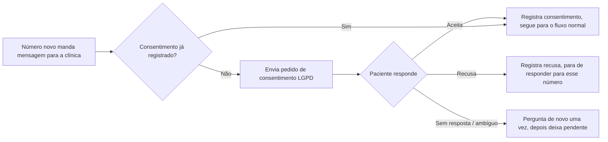
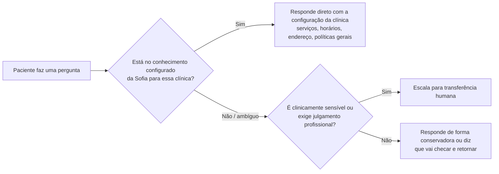
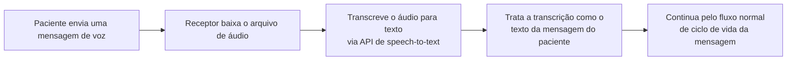
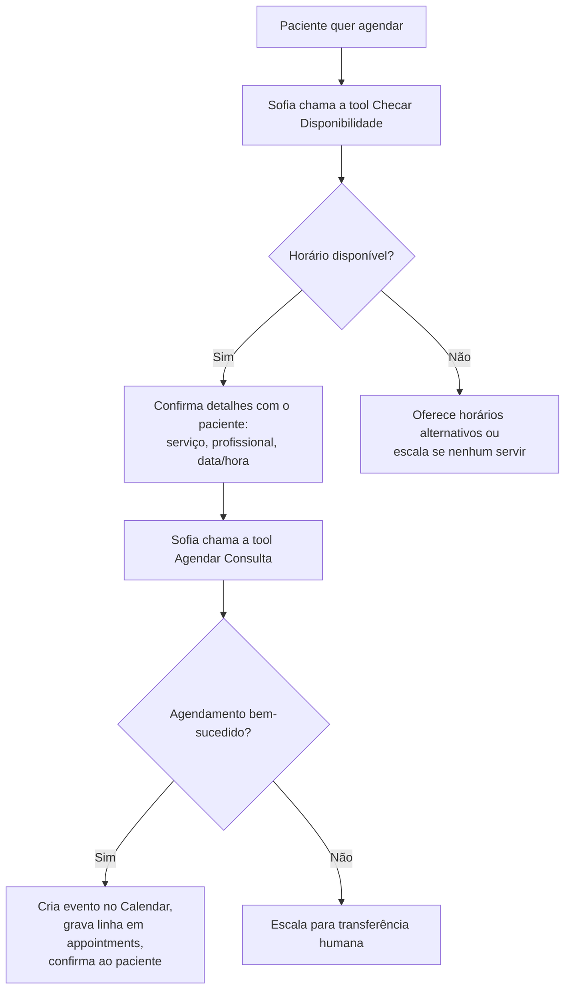
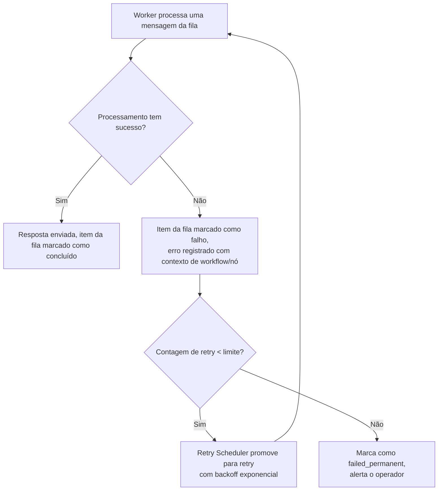
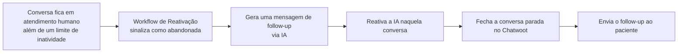

# Fluxos da Sofia IA

> 🇺🇸 [Read in English](../en/sofia-ai-flows.md)

A Sofia não é um prompt único — é um conjunto de fluxos conversacionais distintos, cada um com suas próprias condições de entrada e proteções, orquestrados pelo workflow Worker (ver [Arquitetura](arquitetura.md)). Este documento descreve a lógica de cada fluxo. O texto exato dos prompts não é reproduzido (é proprietário e específico por clínica); a estrutura do fluxo e os pontos de decisão, sim.

## 1. Fluxo de primeira mensagem

A primeira mensagem de qualquer número novo nunca chega ao raciocínio de propósito geral da Sofia — ela é interceptada primeiro pelo gate de consentimento. Essa ordem é deliberada: compliance antes de conversa.

## 2. Fluxo de qualificação

Uma vez registrado o consentimento, a primeira resposta real da Sofia estabelece o contexto básico: o que o paciente está buscando (serviço/especialidade) e se é paciente novo ou já é da clínica. Não é um formulário rígido — está embutido numa conversa natural — mas o objetivo por trás é estruturado: identificar a intenção cedo o suficiente para rotear corretamente (dúvida frequente vs. agendamento vs. "isso precisa de um humano"), em vez de conversar livremente sem direção.

## 3. Fluxo de dúvidas frequentes (FAQ)

A Sofia responde a partir do conhecimento configurado especificamente para aquela clínica (serviços oferecidos, horários, políticas gerais) — ela não responde perguntas clínicas com conhecimento geral do modelo, por regra (ver [Regras de Negócio § 2](regras-de-negocio.md#2-regras-de-atendimento--conversa)).

## 4. Fluxo de mensagem de voz (áudio)

O áudio é normalizado para texto antes de qualquer outra coisa acontecer — a Sofia e toda regra a jusante (gate de consentimento, roteamento de intenção, logs) operam apenas sobre texto, então o suporte a áudio não exigiu tratamento especial na lógica conversacional em si.

## 5. Fluxo de agendamento

O agendamento é mediado por ferramenta, não por prompt: a Sofia não pode simplesmente afirmar no texto da resposta que uma consulta existe. Ela precisa chamar a tool de disponibilidade e a tool de agendamento, que gravam na agenda e no banco de dados reais — é isso que torna a afirmação "a IA agendou minha consulta" verdadeira de fato, e não uma alucinação bem-formulada.

## 6. Fluxo de tratamento de objeções

Quando um paciente hesita (preocupação com preço, incerteza sobre o procedimento, comparação com outra clínica), a Sofia está limitada a: reconhecer a preocupação, reforçar o valor usando apenas informação configurada pela clínica (nunca alegações ou resultados inventados) e oferecer o próximo passo de menor atrito (geralmente agendar uma avaliação, não um fechamento forçado). Se a objeção for sobre algo que a Sofia não tem resposta configurada (ex: um desconto específico fora da configuração), ela não improvisa um compromisso — ela escala ou adia em vez de fazer uma promessa que a clínica não autorizou.

## 7. Fluxo de transferência para humano

Coberto em detalhe em [Arquitetura § 5](arquitetura.md#5-fluxo-de-dados-transferência-para-humano) e [Regras de Negócio § 3](regras-de-negocio.md#3-regras-de-transferência-humana-handoff). Em resumo: pedido explícito, conteúdo sensível, pergunta fora de escopo ou uma operação de agendamento falha disparam o mesmo caminho de transferência — um briefing gerado por IA, uma pausa imediata da IA naquela conversa, e uma conversa etiquetada no Chatwoot para a equipe da clínica.

## 8. Fluxo de erro / fallback

Não existe caminho de falha silenciosa: toda falha é registrada com contexto suficiente (qual workflow, qual nó, a mensagem de erro) para depurar, e toda mensagem eventualmente tem sucesso, chega a um humano, ou vira um item de dead-letter sinalizado que o operador vê — nunca uma mensagem que simplesmente desaparece.

## 9. Fluxo de follow-up / reativação

Esse fluxo existe especificamente para evitar um modo de falha em que um paciente é transferido para um humano, ninguém responde a tempo, e a conversa simplesmente morre. Ele roda em um cronograma (a cada hora) em vez de ser disparado por um evento único, já que "abandono" é uma condição baseada em tempo, não um evento discreto.
